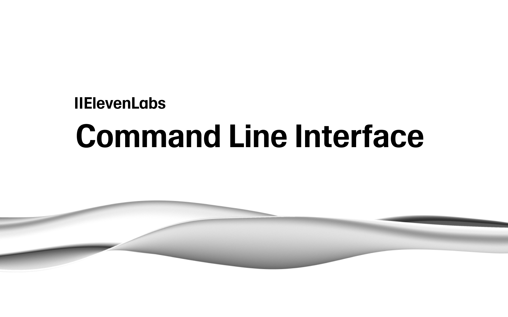

# ElevenLabs CLI - Agents as Code



# ElevenLabs CLI

Build multimodal agents with the [ElevenLabs platform](https://elevenlabs.io/docs/agents-platform/overview).

Manage ElevenLabs with local configuration files. This tool is an experimental exploration of treating agents as code, with features like templates and automatic pushing.

## Features

- **Agent Configuration**: Full ElevenLabs agent schema support
- **Templates**: Pre-built templates for common use cases
- **Smart Updates**: Hash-based change detection
- **Import/Export**: Fetch existing agents and tools from workspace
- **Tool Management**: Import and manage tools from ElevenLabs workspace
- **Widget Generation**: HTML widget snippets
- **Secure Storage**: OS keychain integration with secure file fallback

## Installation

```bash
# Global installation
pnpm install -g @elevenlabs/cli
# OR
npm install -g @elevenlabs/cli

# One-time usage
pnpm dlx @elevenlabs/cli agents init
# OR
npx @elevenlabs/cli agents init
```

## Setup

### Authentication

Login with your ElevenLabs API key (stored securely across all platforms):

```bash
elevenlabs auth login
```

Or set environment variable:

```bash
export ELEVENLABS_API_KEY="your_api_key_here"
```

> **Note**: For now, your API key must be unrestricted to work with the CLI, as ElevenLabs-restricted keys are not available yet.

### Check Status

```bash
elevenlabs auth whoami
```

### Set Residency Location

Configure the API residency for isolated regions:

```bash
# Set to EU residency (uses api.eu.elevenlabs.io)
elevenlabs auth residency eu-residency

# Set to India residency (uses api.in.elevenlabs.io)
elevenlabs auth residency in-residency

# Set to US/Global (uses api.elevenlabs.io or api.us.elevenlabs.io)
elevenlabs auth residency global  # or 'us'
```

### Logout

```bash
elevenlabs auth logout
```

## Quick Start

```bash
# 1. Initialize project
elevenlabs agents init

# Or override existing configuration
elevenlabs agents init --override

# 2. Login with API key
elevenlabs auth login

# 3. Create agent with template
elevenlabs agents add "Support Bot" --template customer-service

# 4. Edit configuration (agent_configs/support_bot.json)

# 5. Sync to ElevenLabs
elevenlabs agents push
```

## Directory Structure

```
your_project/
├── agents.json              # Central configuration
├── tools.json               # Tool configurations
├── tests.json               # Test configurations
├── agent_configs/           # Agent configuration files
├── tool_configs/            # Tool configurations
└── test_configs/            # Test configurations
```

## Commands

### Initialize Project

The `elevenlabs agents init` command sets up the project structure for managing ElevenLabs agents:

```bash
elevenlabs agents init                    # Initialize in current directory
elevenlabs agents init ./my-project       # Initialize in specific directory
elevenlabs agents init --override         # Override existing files and recreate from scratch
```

**Default behavior**: When you run `elevenlabs agents init`, it will:
- Create missing files and directories
- Skip existing files (shown as "skipped" in output)
- Preserve your existing configuration

**Override mode** (`--override`): When you need to reset your project:
- Overwrites all configuration files
- Recreates directory structure from scratch
- **Warning**: This will delete all existing configurations in `agent_configs/`, `tool_configs/`, and `test_configs/`

Use `--override` when:
- You want to start fresh with a clean configuration
- Your configuration has become inconsistent
- You're setting up a new environment and want to ensure clean state

### Core Commands

```bash

# Authentication
elevenlabs auth login
elevenlabs auth logout
elevenlabs auth whoami

# Create agent from template
elevenlabs agents add "Agent Name" [--template customer-service] [--output-path path]

# Create agent from existing config file
elevenlabs agents add [name] --from-file existing-config.json [--output-path path]

# Create webhook tool
elevenlabs tools add-webhook "Tool Name" [--config-path path]

# Create client tool
elevenlabs tools add-client "Tool Name" [--config-path path]

# Push changes
elevenlabs agents push [--agent "Agent Name"] [--dry-run]

# Sync tools
elevenlabs tools push [--tool "Tool Name"] [--dry-run]

# Sync tests
elevenlabs tests push [--dry-run]

# Check status
elevenlabs agents status [--agent "Agent Name"]

# Pull agents from ElevenLabs
elevenlabs agents pull [--search "term"] [--update] [--dry-run]

# Pull tools from ElevenLabs
elevenlabs tools pull [--search "term"] [--tool "tool-name"] [--dry-run] [--output-dir tool_configs]

# Import tests from ElevenLabs
elevenlabs tests pull [--output-dir test_configs] [--dry-run]

# Create and run test
elevenlabs tests add "Test Name" [--template basic-llm]

# Run tests
elevenlabs agents test "Agent Name"

# Generate widget HTML (includes server-location for isolated regions)
elevenlabs agents widget "Agent Name"

# List agents
elevenlabs agents list

# Delete agent (removes locally and from ElevenLabs)
elevenlabs agents delete <agent_id>

# Delete tool locally and from ElevenLabs
elevenlabs tools delete <tool_id>

# Delete all tools
elevenlabs tools delete --all

# Delete test locally and from ElevenLabs
elevenlabs tests delete <test_id>

# Delete all tests
elevenlabs tests delete --all

# Add componenents from [ui.elevenlabs.io](https://ui.elevenlabs.io)
elevenlabs components add "Component Name"
```

### Templates

```bash
# List available templates
elevenlabs agents templates list

# Show template details
elevenlabs agents templates show customer-service
```

## Available Templates

### `default`

Complete configuration with all available fields and sensible defaults. Includes full voice and text support, widget customization, evaluation criteria, and platform settings. Best for production deployments requiring comprehensive configuration.

### `minimal`

Minimal configuration with only essential fields. Contains basic agent prompt, language settings, TTS configuration, and conversation settings. Perfect for quick prototyping and simple use cases.

### `voice-only`

Optimized for voice-only conversations. Disables text input and focuses on voice interaction features. Includes advanced voice settings, turn management, and audio processing optimizations.

### `text-only`

Optimized for text-only conversations. Disables voice features and focuses on text-based interactions.

### `customer-service`

Pre-configured for customer service scenarios. Features professional, empathetic prompts with consistent responses (low temperature). Includes extended conversation duration (30 minutes), evaluation criteria for service quality, and customer-service tags.

### `assistant`

General purpose AI assistant configuration. Balanced creativity settings with helpful, knowledgeable prompts. Supports both voice and text interactions for versatile use cases like Q&A, explanations, and analysis tasks.

## Configuration Example

```json
{
  "name": "Support Bot",
  "conversation_config": {
    "agent": {
      "prompt": {
        "prompt": "You are a helpful customer service representative.",
        "llm": "gemini-2.0-flash",
        "temperature": 0.1
      },
      "language": "en"
    },
    "tts": {
      "model_id": "eleven_turbo_v2",
      "voice_id": "cjVigY5qzO86Huf0OWal"
    }
  },
  "tags": ["customer-service"]
}
```

## Common Workflows

**New Project:**

```bash
elevenlabs agents init
elevenlabs auth login
elevenlabs agents add "My Agent" --template assistant
elevenlabs agents push
```

**Import Existing from ElevenLabs:**

```bash
elevenlabs agents init
elevenlabs auth login
elevenlabs agents pull
elevenlabs agents push
```

**Update Local Agents with Remote Changes:**

```bash
# By default, 'agents pull' skips agents that already exist locally
# Use --update to override local configurations with remote changes
elevenlabs agents pull --update
```

Use `--update` when:
- You've made changes to an agent in the browser or via the API
- You want to sync remote changes to your local configuration
- Your local agent configuration is out of sync with ElevenLabs

**Create Agent from Local Config File:**

```bash
# You have an existing agent config file (e.g., my-template.json)
# Import it and register it with ElevenLabs
elevenlabs agents init
elevenlabs auth login
elevenlabs agents add --from-file my-template.json
# This will:
# - Upload the agent to ElevenLabs
# - Get an agent ID
# - Register it in agents.json
# - Save a copy to agent_configs/
```

**Import and Use Tools:**

```bash
elevenlabs agents init
elevenlabs auth login
elevenlabs tools pull
# Edit tool configs in tool_configs/
# Tools will have 'env' field - modify if needed
# Reference tools in your agent configurations
elevenlabs agents push
```

**Delete Agent:**

```bash
# List agents to find the agent ID
elevenlabs agents list

# Delete agent by ID (removes locally and from ElevenLabs)
elevenlabs agents delete agent_123456789
```

## Workflow Examples

```bash
# List all agents
elevenlabs agents list

# Push all agents
elevenlabs agents push

# Pull agents (skips existing local agents)
elevenlabs agents pull

# Pull and update agents (overrides local with remote)
elevenlabs agents pull --update
```

## Troubleshooting

**Authentication Issues:**

```bash
# Check login status
elevenlabs auth whoami

# Login again
elevenlabs auth login

# Or use environment variable
export ELEVENLABS_API_KEY="your_api_key_here"
```

**Agent Not Found:**

- Check: `elevenlabs agents list`
- Verify: `elevenlabs agents status`

**Push Issues:**

- Preview: `elevenlabs agents push --dry-run`
- Check: `elevenlabs agents status`

**Reset Project:**

```bash
elevenlabs agents init --override
elevenlabs auth login
elevenlabs agents push
```

## Development

```bash
# Install dependencies
pnpm install

# Build
pnpm run build

# Test
pnpm test

# Lint
pnpm run lint
```

## Testing

### Unit Tests
```bash
npm test
```

### E2E Tests

**CRITICAL**: E2E tests require a **dedicated, empty test account**. 

**DO NOT use your production account!** E2E tests will create, modify, and **delete agents** during testing. Any existing agents could be permanently lost.

**Setup:**

1. Create a new ElevenLabs account (separate from production)
2. Verify the account is completely empty (no deployed agents)
3. Generate an API key for this test account
4. Copy `.env.example` to `.env` and add the test account API key
5. Run: `npm run test:e2e`

**Quick safety check before running tests:**
```bash
npm run dev -- auth whoami --no-ui  # Verify you're using test account
npm run dev -- agents list --no-ui  # Should be empty or only test agents
```

## Security

The ElevenLabs CLI stores your API key securely with multiple fallback options:

- **Environment Variable**: `ELEVENLABS_API_KEY` takes highest priority for CI/CD
- **OS Keychain**: Uses native credential store (keytar) when available
- **Secure File**: Falls back to `~/.elevenlabs/api_key` with restricted permissions (600)

Configuration files are stored in `~/.elevenlabs/` with secure directory permissions (700 on Unix-like systems).

## Support

- Use `elevenlabs --help` or `elevenlabs <command> --help`
- Check GitHub issues
- Create new issue with problem details
