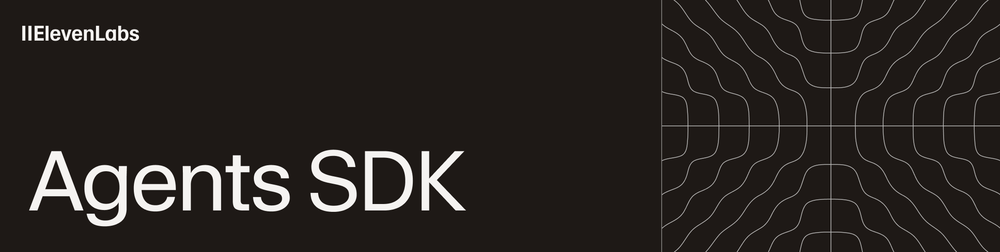

# ElevenLabs CLI - Agents as Code



# ElevenLabs CLI

Build multimodal agents with the [ElevenLabs platform](https://elevenlabs.io/docs/agents-platform/overview).

Manage ElevenLabs with local configuration files. This tool is an experimental exploration of treating agents as code, with features like templates and automatic pushing.

## Features

- **Agent Configuration**: Full ElevenLabs agent schema support
- **Templates**: Pre-built templates for common use cases
- **Smart Updates**: Hash-based change detection
- **Import/Export**: Fetch existing agents and tools from workspace
- **Tool Management**: Import and manage tools from ElevenLabs workspace
- **Widget Generation**: HTML widget snippets
- **Secure Storage**: OS keychain integration with secure file fallback

## Installation

```bash
# Global installation
pnpm install -g @elevenlabs/cli
# OR
npm install -g @elevenlabs/cli

# One-time usage
pnpm dlx @elevenlabs/cli init
# OR
npx @elevenlabs/cli init
```

## Setup

### Authentication

Login with your ElevenLabs API key (stored securely across all platforms):

```bash
elevenlabs login
```

Or set environment variable:

```bash
export ELEVENLABS_API_KEY="your_api_key_here"
```

> **Note**: For now, your API key must be unrestricted to work with the CLI, as ElevenLabs-restricted keys are not available yet.

### Check Status

```bash
elevenlabs whoami
```

### Set Residency Location

Configure the API residency for isolated regions:

```bash
# Set to EU residency (uses api.eu.elevenlabs.io)
elevenlabs residency eu-residency

# Set to India residency (uses api.in.elevenlabs.io)
elevenlabs residency in-residency

# Set to US/Global (uses api.elevenlabs.io or api.us.elevenlabs.io)
elevenlabs residency global  # or 'us'
```

### Logout

```bash
elevenlabs logout
```

### Multi-Environment Management

The ElevenLabs CLI supports managing agents, tools, and tests across multiple isolated environments (e.g., dev, staging, prod).

#### Login to Multiple Environments

```bash
# Login to production
elevenlabs login --env prod

# Login to staging
elevenlabs login --env staging

# Login to development
elevenlabs login --env dev
```

Each environment stores its API key securely and independently.

#### Check All Environments

```bash
elevenlabs whoami
# Shows all configured environments and their authentication status
```

#### Logout from Specific Environment

```bash
elevenlabs logout --env dev
```

#### Environment Field in Configurations

Agent, tool, and test definitions include an `env` field:

```json
{
  "agents": [
    {
      "config": "agent_configs/support_bot.json",
      "id": "agent_123",
      "env": "prod"
    },
    {
      "config": "agent_configs/support_bot_dev.json", 
      "id": "agent_456",
      "env": "dev"
    }
  ]
}
```

When `env` is not specified, it defaults to `prod`.

## Quick Start

```bash
# 1. Initialize project
elevenlabs init

# Or override existing configuration
elevenlabs init --override

# 2. Login with API key (defaults to 'prod' environment)
elevenlabs login

# 3. Create agent with template
elevenlabs add "Support Bot" --template customer-service

# 4. Edit configuration (agent_configs/support_bot.json)

# 5. Sync to ElevenLabs
elevenlabs push
```

> **Note**: This example uses the default 'prod' environment. For multi-environment workflows, see [Multi-Environment Management](#multi-environment-management) and [Multi-Environment Workflows](#multi-environment-workflows).

## Directory Structure

```
your_project/
├── agents.json              # Central configuration with env field per agent
├── tools.json               # Tool configurations with env field per tool
├── tests.json               # Test configurations with env field per test
├── agent_configs/           # Agent configuration files
├── tool_configs/            # Tool configurations
└── test_configs/            # Test configurations
```

## Commands

### Initialize Project

The `elevenlabs init` command sets up the project structure for managing ElevenLabs agents:

```bash
elevenlabs init                    # Initialize in current directory
elevenlabs init ./my-project       # Initialize in specific directory
elevenlabs init --override         # Override existing files and recreate from scratch
```

**Default behavior**: When you run `elevenlabs init`, it will:
- Create missing files and directories
- Skip existing files (shown as "skipped" in output)
- Preserve your existing configuration

**Override mode** (`--override`): When you need to reset your project:
- Overwrites all configuration files
- Recreates directory structure from scratch
- ⚠️ **Warning**: This will delete all existing configurations in `agent_configs/`, `tool_configs/`, and `test_configs/`

Use `--override` when:
- You want to start fresh with a clean configuration
- Your configuration has become inconsistent
- You're setting up a new environment and want to ensure clean state

### Core Commands

```bash

# Authentication
elevenlabs login
elevenlabs logout
elevenlabs whoami

# Create agent
elevenlabs add "Agent Name" [--template customer-service] [--env prod]

# Create webhook tool
elevenlabs add-webhook-tool "Tool Name" [--config-path path] [--env prod]

# Create client tool
elevenlabs add-client-tool "Tool Name" [--config-path path] [--env prod]

# Push changes (operates on all environments by default)
elevenlabs push [--agent "Agent Name"] [--env prod] [--dry-run]

# Sync tools (operates on all environments by default)
elevenlabs push-tools [--tool "Tool Name"] [--env prod] [--dry-run]

# Sync tests (operates on all environments by default)
elevenlabs push-tests [--env prod] [--dry-run]

# Check status
elevenlabs status [--agent "Agent Name"]

# Pull agents from ElevenLabs (pulls from all environments by default)
elevenlabs pull [--search "term"] [--env prod] [--dry-run]

# Pull tools from ElevenLabs (pulls from all environments by default)
elevenlabs pull-tools [--search "term"] [--tool "tool-name"] [--env prod] [--dry-run] [--output-dir tool_configs]

# Import tests from ElevenLabs (pulls from all environments by default)
elevenlabs pull-tests [--output-dir test_configs] [--env prod] [--dry-run]

# Create and run test
elevenlabs add-test "Test Name" [--template basic-llm] [--env prod]

# Run tests
elevenlabs test "Agent Name"

# Generate widget HTML (includes server-location for isolated regions)
elevenlabs widget "Agent Name"

# List agents
elevenlabs list

# Delete agent (removes locally and from ElevenLabs)
elevenlabs delete <agent_id>

# Delete tool locally and from ElevenLabs
elevenlabs delete-tool <tool_id>

# Delete all tools
elevenlabs delete-tool --all

# Delete all tools in specific environment
elevenlabs delete-tool --all --env prod

# Delete test locally and from ElevenLabs
elevenlabs delete-test <test_id>

# Delete all tests
elevenlabs delete-test --all

# Delete all tests in specific environment
elevenlabs delete-test --all --env dev

# Add componenents from [ui.elevenlabs.io](https://ui.elevenlabs.io)
elevenlabs components add "Component Name"
```

### Templates

```bash
# List available templates
elevenlabs templates list

# Show template details
elevenlabs templates show customer-service
```

## Available Templates

### `default`

Complete configuration with all available fields and sensible defaults. Includes full voice and text support, widget customization, evaluation criteria, and platform settings. Best for production deployments requiring comprehensive configuration.

### `minimal`

Minimal configuration with only essential fields. Contains basic agent prompt, language settings, TTS configuration, and conversation settings. Perfect for quick prototyping and simple use cases.

### `voice-only`

Optimized for voice-only conversations. Disables text input and focuses on voice interaction features. Includes advanced voice settings, turn management, and audio processing optimizations.

### `text-only`

Optimized for text-only conversations. Disables voice features and focuses on text-based interactions.

### `customer-service`

Pre-configured for customer service scenarios. Features professional, empathetic prompts with consistent responses (low temperature). Includes extended conversation duration (30 minutes), evaluation criteria for service quality, and customer-service tags.

### `assistant`

General purpose AI assistant configuration. Balanced creativity settings with helpful, knowledgeable prompts. Supports both voice and text interactions for versatile use cases like Q&A, explanations, and analysis tasks.

## Configuration Example

```json
{
  "name": "Support Bot",
  "conversation_config": {
    "agent": {
      "prompt": {
        "prompt": "You are a helpful customer service representative.",
        "llm": "gemini-2.0-flash",
        "temperature": 0.1
      },
      "language": "en"
    },
    "tts": {
      "model_id": "eleven_turbo_v2",
      "voice_id": "cjVigY5qzO86Huf0OWal"
    }
  },
  "tags": ["customer-service"]
}
```

## Common Workflows

**New Project:**

```bash
elevenlabs init
elevenlabs login
elevenlabs add "My Agent" --template assistant
elevenlabs push
```

**Import Existing:**

```bash
elevenlabs init
elevenlabs login
elevenlabs pull
elevenlabs push
```

**Import and Use Tools:**

```bash
elevenlabs init
elevenlabs login
elevenlabs pull-tools
# Edit tool configs in tool_configs/
# Tools will have 'env' field - modify if needed
# Reference tools in your agent configurations
elevenlabs push
```

**Delete Agent:**

```bash
# List agents to find the agent ID
elevenlabs list

# Delete agent by ID (removes locally and from ElevenLabs)
elevenlabs delete agent_123456789
```

> **Tip**: When `--env` is not specified, most commands operate across all configured environments.

## Multi-Environment Workflows

**Setup Multiple Environments:**

```bash
# Initialise project
elevenlabs init

# Login to all environments
elevenlabs login --env dev
elevenlabs login --env staging
elevenlabs login --env prod

# Verify all environments
elevenlabs whoami
```

**Develop and Promote Agents:**

```bash
# Create agent in dev environment
elevenlabs add "My Agent" --template assistant --env dev

# Edit and test in dev
# Edit agent_configs/my_agent.json
elevenlabs push --env dev

# Pull to promote to staging
elevenlabs pull --env dev
# Update env field in agents.json from "dev" to "staging"
elevenlabs push --env staging

# Promote to production
# Update env field to "prod"
elevenlabs push --env prod
```

**Environment-Specific Operations:**

```bash
# Push only dev agents
elevenlabs push --env dev

# Pull only prod agents
elevenlabs pull --env prod

# Delete all dev tools
elevenlabs delete-tool --all --env dev

# Pull tests from staging
elevenlabs pull-tests --env staging
```

**Cross-Environment Management:**

```bash
# List all agents across all environments
elevenlabs list

# Push all agents to their respective environments
elevenlabs push

# Pull agents from all configured environments
elevenlabs pull
```

## Troubleshooting

**Authentication Issues:**

```bash
# Check login status
elevenlabs whoami

# Login again
elevenlabs login

# Or use environment variable
export ELEVENLABS_API_KEY="your_api_key_here"
```

**Agent Not Found:**

- Check: `elevenlabs list`
- Verify: `elevenlabs status`

**Push Issues:**

- Preview: `elevenlabs push --dry-run`
- Check: `elevenlabs status`

**Reset Project:**

```bash
elevenlabs init --override
elevenlabs login
elevenlabs push
```

## Development

```bash
# Install dependencies
pnpm install

# Build
pnpm run build

# Test
pnpm test

# Lint
pnpm run lint
```

## Testing

### Unit Tests
```bash
npm test
```

### E2E Tests

**CRITICAL**: E2E tests require a **dedicated, empty test account**. 

**DO NOT use your production account!** E2E tests will create, modify, and **delete agents** during testing. Any existing agents could be permanently lost.

**Setup:**

1. Create a new ElevenLabs account (separate from production)
2. Verify the account is completely empty (no deployed agents)
3. Generate an API key for this test account
4. Copy `.env.example` to `.env` and add the test account API key
5. Run: `npm run test:e2e`

**Quick safety check before running tests:**
```bash
npm run dev -- whoami --no-ui  # Verify you're using test account
npm run dev -- list --no-ui     # Should be empty or only test agents
```

## Security

The ElevenLabs CLI stores your API key securely with multiple fallback options:

- **Environment Variable**: `ELEVENLABS_API_KEY` takes highest priority for CI/CD
- **OS Keychain**: Uses native credential store (keytar) when available
- **Secure File**: Falls back to `~/.elevenlabs/api_key` with restricted permissions (600)

Configuration files are stored in `~/.elevenlabs/` with secure directory permissions (700 on Unix-like systems).

## Support

- Use `elevenlabs --help` or `elevenlabs <command> --help`
- Check GitHub issues
- Create new issue with problem details
