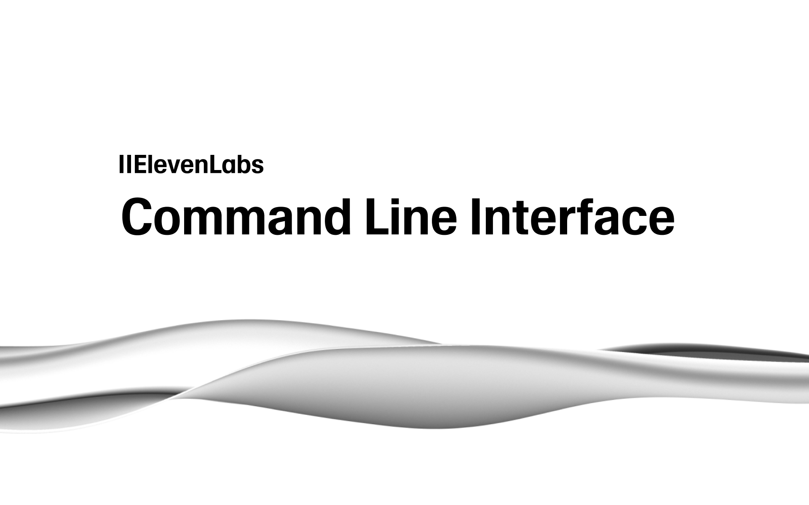

# ElevenLabs CLI — Agents as Code



Command-line interface for the [ElevenLabs platform](https://elevenlabs.io/docs/agents-platform/overview).

The CLI does two things:

- **Full API access** — every ElevenLabs API endpoint is available as a subcommand (`elevenlabs <resource> <method>`).
- **Agents as Code** — manage Conversational AI agents from local configuration files, with templates, branches, and push/pull sync.

## Table of contents

- [Installation](#installation)
- [Authentication](#authentication)
- [Quick start](#quick-start)
- [Agents as Code](#agents-as-code)
- [Data residency](#data-residency)
- [UI components](#ui-components)
- [Usage](#usage)
- [Documentation](#documentation)
- [Advanced](#advanced)
  - [Common flags](#common-flags)
  - [Environment variables](#environment-variables)
  - [Output formats](#output-formats)
  - [Shell completion](#shell-completion)

## Installation

### Shell (macOS / Linux)

```bash
curl --proto '=https' --tlsv1.2 -LsSf https://github.com/elevenlabs/cli/releases/latest/download/elevenlabs-installer.sh | sh
```

### PowerShell (Windows)

```powershell
powershell -ExecutionPolicy ByPass -c "irm https://github.com/elevenlabs/cli/releases/latest/download/elevenlabs-installer.ps1 | iex"
```

### Build from source

If you prefer to build from source, install the [Rust toolchain](https://rustup.rs/) and run:

```bash
cargo build --release
./target/release/elevenlabs --help
```

## Authentication

This API requires authentication. Run `elevenlabs --help` for details.

## Quick start

List available commands:

```bash
elevenlabs --help
```

Call an API endpoint:

```bash
elevenlabs <resource> <method>
```

Run `elevenlabs <resource> --help` to see available methods for a resource.

## Agents as Code

Manage Conversational AI agents from local configuration files. `elevenlabs agents init` scaffolds a project; agent configs live as JSON on disk and sync to ElevenLabs. Pulled configs are stored as raw wire JSON and pushed back verbatim, so they round-trip losslessly.

### Project structure

```
your_project/
├── agents.json         # Agent registry: ids + branch mappings → config paths
├── tools.json          # Tool registry
├── tests.json          # Test registry
├── agent_configs/      # Agent configuration files
├── tool_configs/       # Tool configuration files
└── test_configs/       # Test configuration files
```

### Commands

```bash
# Scaffold a new project (pass a path, or --override to reset an existing one)
elevenlabs agents init [path] [--override]

# Create an agent from a template (or an existing file), upload it, and register it
elevenlabs agents add <name> [--template <template>] [--output-path <path>]
elevenlabs agents add [name] --from-file <path>

# Show the status of locally-configured agents
elevenlabs agents status

# Sync configs with ElevenLabs (push force-overrides main + registered branches)
elevenlabs agents push [--agent <agent_id>] [--branch <name|id>] [--version-description <text>] [--dry-run]
elevenlabs agents pull [--agent <agent_id>] [--branch <name|id>] [--all-branches] [--update] [--all] [--dry-run]

# List available agent templates, or print one's full configuration
elevenlabs agents templates list
elevenlabs agents templates show <template>

# Print an embeddable HTML widget snippet for an agent
elevenlabs agents widget <agent_id>

# Run the tests attached to an agent (polls to completion; exits non-zero on failure)
elevenlabs agents test <agent_id>
```

These sit alongside the generated API commands in the same group, which own the
primitives — `elevenlabs agents create | get | list | update | delete`, and the
`elevenlabs agents branches ...` subgroup for branch management.


### Tools

Manage the webhook and client tools your agents reference. Tools are tracked in `tools.json` with configs under `tool_configs/`.

```bash
# Create a webhook or client tool, upload it, and register it in tools.json
elevenlabs tools add <name> [--type webhook|client] [--config-path <path>]

# Sync tool configs with ElevenLabs
elevenlabs tools push [--tool <tool_id>] [--dry-run]
elevenlabs tools pull [--tool <tool_id>] [--output-dir tool_configs] [--update] [--all] [--dry-run]

# Delete a tool locally and in ElevenLabs
elevenlabs tools delete <tool_id>
elevenlabs tools delete --all
```

### Tests

Manage agent tests, tracked in `tests.json` with configs under `test_configs/`. Attach them to an agent's `platform_settings.testing.attached_tests` and run them with `elevenlabs agents test <agent_id>`.

```bash
# Create a test from a template, upload it, and register it in tests.json
elevenlabs tests add <name> [--template basic-llm|tool|conversation-flow|customer-service]
elevenlabs tests templates list

# Sync test configs with ElevenLabs
elevenlabs tests push [--test <test_id>] [--config-dir test_configs] [--dry-run]
elevenlabs tests pull [--test <test_id>] [--output-dir test_configs] [--update] [--all] [--dry-run]

# Delete a test locally and in ElevenLabs
elevenlabs tests delete <test_id>
elevenlabs tests delete --all
```

`tests push` also **auto-discovers** untracked configs: it scans `--config-dir` recursively for `.json` files that look like tests (a `chat_history` array or a `success_condition` string) and registers them in `tests.json` before pushing, so you can drop a config in and push without editing the index by hand.

### Templates

Pre-built starting configurations for `agents add`, listed by `elevenlabs agents templates list` (inspect one with `agents templates show <template>`):

| Template | Description |
|----------|-------------|
| `default` | Complete configuration with all available fields and sensible defaults |
| `minimal` | Minimal configuration with only essential fields |
| `voice-only` | Optimized for voice-only conversations |
| `text-only` | Optimized for text-only conversations |
| `customer-service` | Pre-configured for customer service scenarios |
| `assistant` | General purpose AI assistant configuration |

## Data residency

Select the region your requests are routed to. The setting is stored in `~/.elevenlabs/config.json` and applies to **every** command:

```bash
elevenlabs residency                 # show the current region and its base URL
elevenlabs residency eu-residency    # switch region
```

| Region | Base URL |
|--------|----------|
| `global` (default) | `https://api.elevenlabs.io` |
| `us` | `https://api.us.elevenlabs.io` |
| `eu-residency` | `https://api.eu.residency.elevenlabs.io` |
| `in-residency` | `https://api.in.residency.elevenlabs.io` |
| `sg-residency` | `https://api.sg.residency.elevenlabs.io` |

`--base-url` and `ELEVENLABS_BASE_URL` take precedence when you need a one-off override. The region also sets the `server-location` attribute emitted by `agents widget`.

## UI components

Install [ElevenLabs UI](https://ui.elevenlabs.io) components into your project (delegates to `shadcn`, so Node.js/npm is required):

```bash
elevenlabs components add                    # all components
elevenlabs components add conversation-bar
```

## Usage

Every API resource appears as a subcommand (e.g. `elevenlabs <resource> <method>`). Run `elevenlabs <resource> --help` to see available methods.

Provide request parameters as flags or as JSON:

```bash
elevenlabs <resource> <method> --json '{"key": "value"}'
```

## Documentation

See [reference.md](./reference.md) for the full command reference.

## Advanced

### Common flags

These flags are available on every operation:

| Flag | Description |
|------|-------------|
| `--dry-run` | Validate the request locally and print the HTTP request without sending it |
| `--json <JSON\|->` | Supply a request body as JSON (or `-` to read stdin) |
| `--params <JSON>` | Merge extra parameters as JSON (overrides individual flags) |
| `--format <json\|table\|yaml\|csv>` | Output format (default `json`) |
| `--output <PATH>` | Write binary responses to a file |
| `--base-url <URL>` | Override the API base URL |
| `--page-all` | Auto-paginate and stream results as NDJSON |
| `--page-limit <N>` | Max pages to fetch when auto-paginating (default `10`) |
| `-q, --quiet` | Suppress stdout output on success (errors still go to stderr) |

### Environment variables

| Variable | Description |
|----------|-------------|
| `ELEVENLABS_BASE_URL` | Override the API base URL |
| `ELEVENLABS_CA_BUNDLE` | Path to PEM file with extra trust roots (or `SSL_CERT_FILE`) |
| `ELEVENLABS_INSECURE=1` | Skip TLS verification (debugging only) |
| `ELEVENLABS_PROXY` | HTTP(S) proxy URL |
| `ELEVENLABS_TIMEOUT_SECS` | Total request timeout in seconds |

Standard environment variables (`HTTPS_PROXY` / `HTTP_PROXY` / `NO_PROXY` / `SSL_CERT_FILE`) are also honored.

### Output formats

Use the global `--format` flag to control output. Supported values: `json` (default), `table`, `yaml`, `csv`.

```bash
# Pipe JSON output through jq
elevenlabs <resource> <method> --format json | jq

# Machine-readable catalog of every operation
elevenlabs --help --format json | jq 'length'
```

### Shell completion

Generate shell completion scripts:

```bash
elevenlabs completion <bash|zsh|fish|powershell>
```

